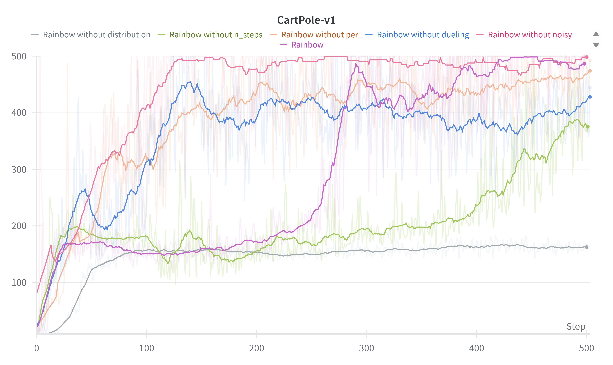

## Rainbow DQN Reproduction

This project is a reproduction of the **Rainbow** algorithm from [Hessel et al., 2018](https://arxiv.org/abs/1710.02298), which combines several improvements to the original DQN. The implementation includes:

- **Double DQN** ([Van Hasselt et al., 2015](https://arxiv.org/abs/1509.06461))  
- **Dueling DQN** ([Wang et al., 2015](https://arxiv.org/abs/1511.06581))  
- **n-step DQN** ([Mnih et al., 2016](https://arxiv.org/abs/1602.01783))  
- **Prioritized Experience Replay** ([Schaul et al., 2015](https://arxiv.org/abs/1511.05952))  
- **Distributional DQN (C51)** ([Bellemare et al., 2017](https://arxiv.org/abs/1707.06887))  
- **Noisy DQN** ([Fortunato et al., 2017](https://arxiv.org/abs/1706.10295))

---

## Results

<!-- You can insert performance plots here -->

---

## Environment

- Python 3.11.11  
- PyTorch 2.6.0

---